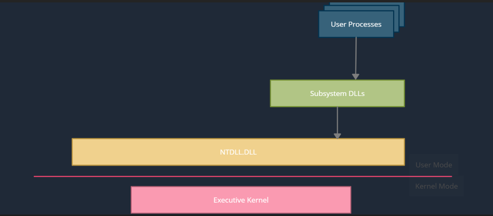

### Wndows Architecture
<br>
```
User Land (kernel32.dll, user32.dll,...)  -->  ntdll.dll  -->  Kernel Land (System Calls)
```

### Win API 
```
The Windows API provides developers with a way for their applications to interact with 
the Windows operating system. 

For example, if the application needs to display something on the screen, modify a file
or query the registry all of these actions can be done via the Windows API.
```

### PE Format
<br>
```
IMAGE_DOS_HEADER
IMAGE_NT_HEADERS
```

### Payload location
```
1-data
2-rdata
3-rsrc
```

### Payload Encryption
```
1-xor
2-rc4
3-aes
```

### Payload Obfuscation
```
1-IPv4/IPv6Fuscation
2-MACFuscation
3-UUIDFuscation
```
